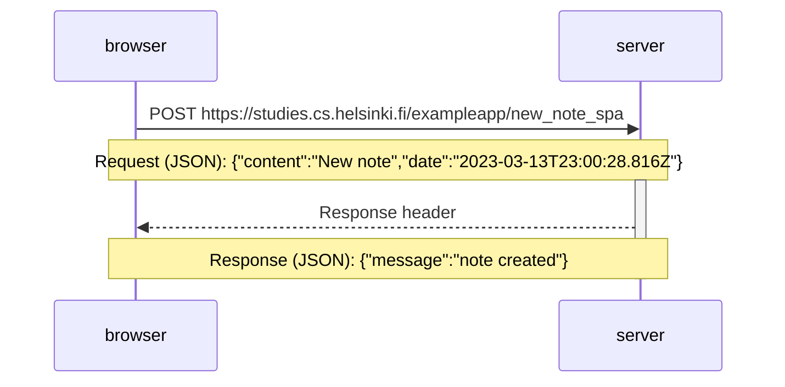

```mermaid
sequenceDiagram
    participant browser
    participant server

    browser->>server: POST https://studies.cs.helsinki.fi/exampleapp/new_note_spa
    Note over browser, server: Request (JSON): {"content":"New note","date":"2023-03-13T23:00:28.816Z"}
    activate server
    server-->>browser: Response header
    Note over browser, server: Response (JSON): {"message":"note created"}
    deactivate server
```